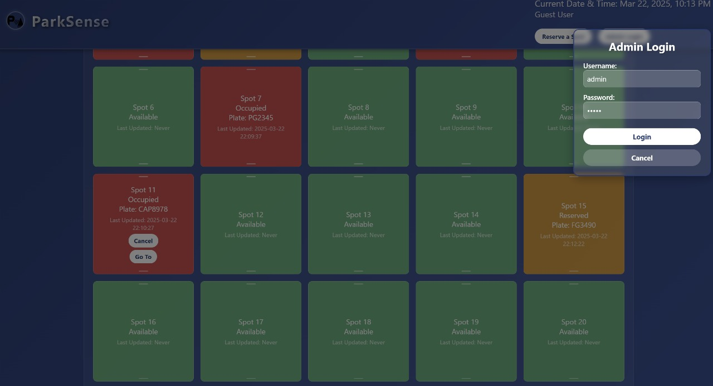
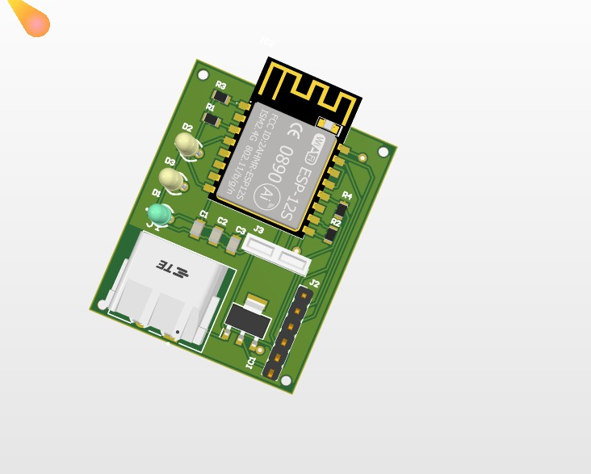

# Smart Parking Assistant 🚗





## Introduction
Smart Parking Assistant is a modern solution to urban parking congestion, using real-time vehicle identification, automated registration, and intelligent space optimization. The system leverages sensors, computer vision, and data analytics to minimize search time, reduce congestion, and improve the parking experience for users and operators.

---


## Key Features
- Real-time spot allocation and monitoring
- License plate recognition (LPR) for automated entry/exit
- Reservation and premium parking options
- Predictive analytics for demand and space optimization
- Mobile/web dashboard for users and admins
- IoT-enabled sensors and custom PCB hardware

---


## Technical Overview
- Sensors: Ultrasonic/infrared for occupancy, cameras for LPR
- Custom PCB for sensor integration
- Arduino/Raspberry Pi for hardware control and image processing
- Data sent via MQTT/HTTP to backend (Django/Node.js)
- ML models (scikit-learn/TensorFlow) for demand prediction and optimization
- Cloud hosting for scalability

---


## Example User Flow
1. User checks and reserves a spot via the app/ui.
2. LPR system grants entry and assigns a spot.
3. Sensors update occupancy in real time.
4. User receives notifications and can extend or end reservation.
5. Seamless exit and digital payment.

---


## UI Overview
- Modern dashboard with real-time parking map
- Admin and guest flows
- Reservation and login modals
- Draggable/editable parking slots

---


## Team
**Team Name:** Sentinels  
**Category:** University


---


## License
This project is licensed under the MIT License.

---


## Contact
For inquiries or collaboration, please open an issue or contact the team via GitHub.

---

## Getting Started
1. **Clone the repository**
   ```bash
   git clone https://github.com/rivindu02/Smart-Parking-Assistant.git
   ```
2. **Install dependencies** (see documentation for your platform)
3. **Run the application**
   ```bash
   python app.py
   ```
